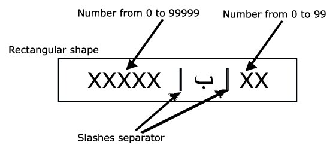

# 🚗 Moroccan License Plate Detection and Recognition

## 📖 Overview

This project focuses on developing a computer vision system to detect and recognize Moroccan license plates using YOLO and Optical Character Recognition (OCR). By leveraging a dataset of Moroccan vehicle plates, the system aims to automate license plate recognition, overcoming challenges specific to Arabic characters and plate designs.
## Application Screenshot


**👥 Team Members:**
- [LAKHLOUFI ISMAIL](https://github.com/ismaillakhloufi) :
- [BOURKI ACHRAF](https://github.com/BOURKI970/) : 
- [AMMI YOUSSEF](https://github.com/youssefammi123/) : 

## 🎯 Objectives
-  Implement object detection using **YOLO** for license plate segmentation.
-  Extract and recognize characters from Moroccan license plates with OCR.
-  Optimize performance for real-world scenarios with diverse lighting and backgrounds.

## 📂 Dataset
We utilized a publicly available dataset of Moroccan vehicle plates containing:
- 📷 **705 unique images**: Cars, trucks, motorcycles.
- 🔠 Arabic characters and digits for plate segmentation and OCR.
- 🎛️ Data augmentation techniques applied, expanding the dataset to **4,935 images**.

### 🚗 Moroccan License Plate Structure


### 🔄 Data Preprocessing
-  **Segmentation**: Cropped images to isolate plates.
-  **Augmentation**: Applied noise, contrast adjustments, flipping, and rotations.
-  **Formats**: Data labeled in XML, CSV, and YOLO-specific text files.

## 🛠️ Methodology
1. **Plate Detection**:
   -  Used **YOLOv8** for efficient and accurate plate localization.
   -  Achieved **x% accuracy** on the test set.
2. **Character Recognition**:
   - 🔍 Explored various models:
     -  Histogram Projection + k-NN
     -  Histogram Projection + CNN (MobileNetV2)
     -  **YOLOv8** for simultaneous character detection and classification.
   -  YOLOv8 demonstrated the best performance with **x% accuracy** on the test set.

## 💻 Tools and Technologies
- 💡 **Programming Languages**: Python
- ⚙️ **Frameworks**: YOLOv8, TensorFlow, OpenCV
- 📚 **Libraries**: NumPy, Pandas, Matplotlib
- 🔧 **Others**: Data augmentation with Python scripts

## 🖥️ How to start
 **Clone the Repository** :
   ```bash
  git clone https://github.com/your-repo/moroccan-license-plate-detection.git
cd moroccan-license-plate-detection
   ```

## 📜 Licence
This project is licensed under the [MIT License](LICENSE).  

